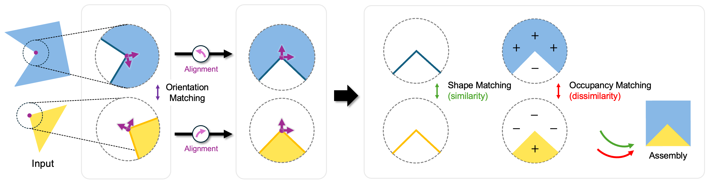

<h1 align="center"> Combinative Matching for Geometric Shape Assembly
</h1>

<h3 align="center">✨ ICCV 2025 Highlight ✨</h3>
<div align="center">
  <a href="https://nahyuklee.github.io/" target="_blank">Nahyuk Lee</a>&nbsp;<sup>1*</sup> &ensp;  &ensp;
  <a href="https://juhongm999.github.io/" target="_blank">Juhong Min</a>&nbsp;<sup>1,2*</sup> &ensp; &ensp;
  <a href="https://www.linkedin.com/in/junhong-lee-b79908338/" target="_blank">Junhong Lee</a>&nbsp;<sup>1</sup> &ensp;  &ensp;
  <a href="https://chrockey.github.io/" target="_blank">Chunghyun Park</a>&nbsp;<sup>1</sup> &ensp;  &ensp;
  <a href="https://cvlab.postech.ac.kr/~mcho/" target="_blank">Minsu Cho</a><sup>1,3</sup>
  <br>
  <sup>1</sup> POSTECH &emsp; <sup>2</sup> Samsung Research America &emsp; <sup>3</sup> RLWRLD
  <br>
  <sup>*</sup> Equal contribution
  <br><br>

[](https://arxiv.org/abs/2508.09780)&nbsp; [](https://nahyuklee.github.io/cmnet)
</div>

<p align="middle">
    
</p>

**Summary:** We propose a new shape-matching methodology, ***Combinative Matching***, which significantly reduces local ambiguities in matching by explicitly modeling both *identical surface shapes* and *opposite volume occupancy*.

## Requirements
- Python 3.8
- PyTorch 1.10.1
- PyTorch Lightning 1.9

Conda environment settings:
```bash
conda create -n cmnet python=3.8
conda activate cmnet

pip install torch==1.10.1+cu111 torchvision==0.11.2+cu111 torchaudio==0.10.1 -f https://download.pytorch.org/whl/cu111/torch_stable.html
pip install pytorch-lightning==1.9
pip install einops trimesh wandb open3d gtsam
pip install git+https://github.com/KinglittleQ/torch-batch-svd
pip install git+'https://github.com/otaheri/chamfer_distance'
pip install "git+https://github.com/facebookresearch/pytorch3d.git@stable"

cd lib/pointops
python setup.py install && cd -
```

## Dataset
To use the Breaking Bad dataset, follow the instructions in [this repository](https://github.com/Breaking-Bad-Dataset/Breaking-Bad-Dataset.github.io?tab=readme-ov-file) to download both the `everyday` and `artifact` subsets.

#### Note 
- We used the **Volume-constrained Breaking Bad dataset (v2)** for the main experiments.
- Additional evaluation results on the **Vanilla Breaking Bad dataset (v1)** are provided in our supplementary material [[arXiv](https://arxiv.org/abs/2508.09780)]. 

## Pairwise Assembly (2 parts)
### Training
```bash
# Single-GPU training for pairwise assembly
python main.py --data_category {everyday, artifact} --logpath {exp_name} 

# Multi-GPU training (ex. 4 GPUs) for pairwise assembly 
python main.py --data_category {everyday, artifact} --logpath {exp_name} --gpus 0 1 2 3 
```
### Testing
```bash
# Pairwise assembly testing
python test.py --data_category {everyday, artifact} --load {ckp_path} 
```

## Multi-part Assembly (2~20 parts)
### Training
To train and test on multi-part assembly, please use the `--mpa` flag on `main.py`.

```bash
# Single-GPU training for multi-part assembly
python main.py --data_category {everyday, artifact} --logpath {exp_name} --mpa

# Multi-GPU training (ex. 4 GPUs) for multi-part assembly
python main.py --data_category {everyday, artifact} --logpath {exp_name} --mpa --gpus 0 1 2 3 
```
### Testing
For multi-part assembly testing, please use `multi_part_assembly.py`, which includes pose graph optimization support.
```bash
# Multi-part assembly testing
python multi_part_assembly.py --data_category {everyday, artifact} --load {ckp_path}
```

## Checkpoints
Checkpoints for both **Vanilla Breaking Bad (v1)** and **Volume-constrained Breaking Bad (v2)** datasets are available on our [[Google Drive](https://drive.google.com/drive/folders/1nxX5dAAH2ijyPqTAWJ2E7Sn-DuMiBflt?usp=share_link)].

## BibTeX
If you use this code for your research, please consider citing:
```BibTeX
@inproceedings{lee2025combinative,
  title={Combinative Matching for Geometric Shape Assembly},
  author={Lee, Nahyuk and Min, Juhong and Lee, Junhong and Park, Chunghyun and Cho, Minsu},
  booktitle={Proceedings of the IEEE/CVF International Conference on Computer Vision},
  pages={9540--9549},
  year={2025}
}
```

## Related Repos
The codebase is largely built on the following repositories.
- [PMTR](https://github.com/NahyukLEE/pmtr) (ICML 2024)
- [GeoTransformer](https://github.com/qinzheng93/GeoTransformer) (CVPR 2022)
- [Jigsaw](https://github.com/Jiaxin-Lu/Jigsaw) (NeurIPS 2023)